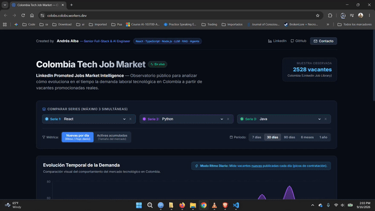
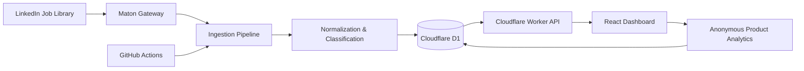

# ColObs — Colombia Tech Job Market Observatory

**A public data product for tracking technology job-market trends in Colombia.**

ColObs collects, normalizes, classifies, and visualizes promoted technology job postings in Colombia to help answer questions such as:

- Is demand for React increasing or decreasing?
- How does Python compare with Java or JavaScript?
- Is Full Stack growing relative to Frontend?
- What is happening with AI Engineering, LLMs, RAG, agents, and LangChain?
- Which technology combinations appear most frequently in the market?

The project is designed as a real, continuously updated data product rather than a static portfolio demo.

## 🚀 Live Demo

### [Open ColObs](https://colobs.colobs.workers.dev)

**Production:**  
https://colobs.colobs.workers.dev

No login or account is required.

### Demo



---

## What ColObs Does

ColObs transforms raw job-posting data into an interactive market intelligence dashboard.

Users can:

- compare up to **three technologies or roles**
- analyze periods of **7, 30, 90, 180, or 365 days**
- compare **new job postings over time**
- inspect the observable job volume represented in the collected dataset
- explore frontend, backend, full-stack, and AI-related demand
- compare technologies such as React, Angular, Vue, Python, Java, Node.js, Spring, FastAPI, RAG, LLMs, and AI Agents
- view market trends through interactive time-series visualizations

The application is public and intentionally simple: the goal is to understand the market in seconds.

---

## Why I Built It

Job-market perception is often based on a small number of vacancies seen on LinkedIn or other job boards.

That makes questions such as these surprisingly difficult to answer:

> Is React actually declining?

> Is Python demand increasing?

> Is AI Engineering becoming a meaningful part of the Colombian market?

> Is Backend stronger than Frontend right now?

ColObs approaches those questions as a data problem.

Instead of relying on impressions, it stores individual job postings, classifies their technologies and roles, and builds comparable time series from the resulting dataset.

---

## Architecture



The system deliberately separates:

```text
Data Source
    ↓
Ingestion
    ↓
Normalization
    ↓
Database
    ↓
Analytics API
    ↓
Dashboard
```

This means the data provider can be replaced without redesigning the entire application.

---

## Tech Stack

### Frontend

- React
- TypeScript
- Vite
- Recharts
- Lucide React

### Backend / API

- TypeScript
- Cloudflare Workers
- REST endpoints
- Node.js tooling for ingestion and local development

### Data

- Cloudflare D1
- SQLite-compatible relational model
- many-to-many job ↔ technology classification

### Automation

- GitHub Actions
- scheduled daily ingestion
- incremental updates
- idempotent database writes

### Analytics

- Cloudflare Web Analytics
- first-party anonymous interaction events
- private administrative analytics

### Deployment

- Cloudflare Workers
- Cloudflare Static Assets
- Cloudflare D1

The production architecture is designed to operate with **$0 fixed monthly infrastructure cost** at the current scale.

---

## Data Pipeline

The ingestion pipeline follows several stages.

### 1. Collection

Job postings are retrieved from **LinkedIn Job Library through the Maton API gateway**.

The project does not directly scrape LinkedIn.

### 2. Deduplication

The fundamental unit of the system is an individual job posting.

Jobs are primarily deduplicated using their external LinkedIn job identifier.

A vacancy found through several different keyword searches is still stored only once.

### 3. Classification

Each vacancy is analyzed using a deterministic classification engine.

A single job can belong to multiple technologies and roles.

For example:

```text
Senior Full Stack AI Engineer

→ TypeScript
→ React
→ Node.js
→ Python
→ RAG
→ AI Engineer
→ Full Stack
```

### 4. Normalization

Different ways of referring to the same technology are normalized into one canonical category.

Examples:

```text
Node
NodeJS
Node.js

→ Node.js
```

and:

```text
Gen AI
GenAI
Generative AI

→ Generative AI
```

### 5. Persistence

Normalized jobs and their technology relationships are stored in Cloudflare D1.

### 6. Analytics

The Worker API calculates time-series data and summary statistics from the stored dataset.

### 7. Visualization

The React application turns those results into an interactive market dashboard.

---

## Automatic Daily Updates

ColObs is not a static dataset.

A scheduled GitHub Actions workflow runs every day and:

1. queries recent job postings
2. uses a rolling 48-hour overlap window
3. filters out older postings
4. deduplicates jobs
5. classifies technologies and roles
6. generates an incremental database update
7. applies the update to Cloudflare D1
8. verifies the production database after ingestion

The overlap window makes the process resilient to postings that become visible between consecutive executions.

Database operations are idempotent, so existing jobs are updated rather than duplicated.

---

## Technology Taxonomy

The current taxonomy includes **26 technologies and roles** across several groups.

### Languages

- JavaScript
- TypeScript
- Python
- Java
- C#
- Go
- Rust

### Frontend

- React
- Next.js
- Angular
- Vue

### Backend

- Node.js
- FastAPI
- Django
- Spring
- .NET

### Artificial Intelligence

- AI Engineer
- Generative AI
- LLM
- RAG
- Agents
- LangChain

### Roles

- Frontend
- Backend
- Full Stack
- Software Engineer

The taxonomy is intentionally extensible.

---

## Data Model

The core database follows a normalized relational model.

```text
jobs
 ├── id
 ├── external_job_id
 ├── title
 ├── company
 ├── location
 ├── country
 ├── description
 ├── url
 ├── published_at
 ├── first_seen_at
 ├── last_seen_at
 └── is_active

technologies
 ├── id
 ├── name
 ├── slug
 └── category

job_technologies
 ├── job_id
 └── technology_id
```

A job can therefore belong to multiple technologies without duplicating the original vacancy.

---

## Public API

The dashboard consumes the same production API exposed by the Cloudflare Worker.

Main endpoints include:

```text
GET /api/health
GET /api/series
GET /api/timeline
GET /api/summary
```

Example:

```text
https://colobs.colobs.workers.dev/api/health
```

The public API and frontend are served from the same Cloudflare Worker deployment.

Administrative analytics are kept behind authenticated endpoints and are not part of the public interface.

---

## Product Analytics

ColObs contains two different analytics layers.

### Labor-market intelligence

Measures what companies are requesting:

```text
job postings
technologies
roles
time-series evolution
```

### Product-interest intelligence

Measures anonymously what visitors are investigating:

```text
selected technologies
comparisons
selected periods
dashboard interactions
```

This makes it possible to distinguish between:

**what the labor market is demanding**

and

**what developers, recruiters, and other visitors are interested in researching.**

No account is required to use the dashboard.

---

## Data Scope & Methodology

ColObs does **not** claim to represent every job vacancy available in Colombia.

The current dataset represents a consistent sample based on:

> **LinkedIn Promoted Jobs — Colombia**

The purpose of the project is therefore to analyze:

- trends
- relative demand
- technology comparisons
- changes over time

rather than claim an absolute count of all technology employment opportunities in the country.

This distinction is important when interpreting the charts.

---

## Repository Structure

```text
colobs/
│
├── backend/
│   ├── scripts/
│   │   ├── run_ingestion.ts
│   │   ├── run_daily_d1_ingestion.ts
│   │   └── export_d1_import.ts
│   │
│   └── src/
│       ├── api/
│       ├── classifier/
│       ├── db/
│       ├── ingestion/
│       └── worker.ts
│
├── frontend/
│   ├── src/
│   └── dist/
│
├── .github/
│   └── workflows/
│       └── daily_ingest.yml
│
├── wrangler.jsonc
└── README.md
```

---

## Engineering Decisions

A few decisions were particularly important in this project.

### Store jobs, not aggregate counts

Instead of storing:

```text
React = 500
Python = 650
```

ColObs stores the individual vacancies.

Aggregations can then be recalculated later without recollecting the original data.

### Many-to-many classification

One vacancy can represent several technologies simultaneously.

This allows the dataset to support more complex analysis without creating separate databases for React, Python, Java, AI, etc.

### Deterministic classification first

The first classification layer uses explicit rules instead of an LLM.

That makes classification:

- reproducible
- inexpensive
- explainable
- easy to test

AI-assisted classification can be introduced later for genuinely ambiguous cases.

### Incremental ingestion

After the historical dataset was created, daily updates became incremental.

There is no reason to download the entire historical dataset every day.

### Serverless production architecture

The frontend, API, database, analytics, and scheduled ingestion were designed around free/serverless infrastructure suitable for a public portfolio data product.

---

## What This Project Demonstrates

ColObs was built to demonstrate more than frontend development.

It includes:

- product definition
- React application development
- TypeScript
- data ingestion
- third-party API integration
- SQL and relational modeling
- normalization
- deterministic classification
- deduplication
- time-series analytics
- REST API design
- data visualization
- Cloudflare Workers
- Cloudflare D1
- scheduled data pipeline automation
- GitHub Actions
- production deployment
- observability
- product analytics
- privacy-conscious telemetry

---

## Running the Project Locally

### Requirements

- Node.js 22+
- npm
- a Maton API key for ingestion

### Backend dependencies

```bash
cd backend
npm ci
```

Create the local environment configuration from:

```text
backend/.env.example
```

The ingestion environment uses:

```text
MATON_API_KEY
LINKEDIN_VERSION
MATON_GATEWAY_URL
```

Never commit API keys or production secrets.

### Frontend

```bash
cd frontend
npm ci
npm run dev
```

To create a production build:

```bash
npm run build
```

---

## Production

The production application is available at:

### https://colobs.colobs.workers.dev

The frontend, Worker API, D1 database, scheduled ingestion, and analytics are all running as part of the deployed system.

---

## Creator

**Andrés Alba**

Senior Full-Stack & AI Engineer

Focused on modern web applications, data products, and applied AI systems including LLM applications, RAG, and agentic workflows.

GitHub Profile:  
https://github.com/andresalba-tech

Source Code:  
https://github.com/andresalba-tech/colobs

---

## Project Status

**Production / Public**

- Public dashboard: ✅
- Historical dataset: ✅
- Technology classification: ✅
- Time-series analytics: ✅
- Cloudflare D1: ✅
- Cloudflare Worker API: ✅
- Automatic daily ingestion: ✅
- Product analytics: ✅
- Cloudflare Web Analytics: ✅
- GitHub Actions automation: ✅

---

## Live Demo

### [Open ColObs →](https://colobs.colobs.workers.dev)

https://colobs.colobs.workers.dev
